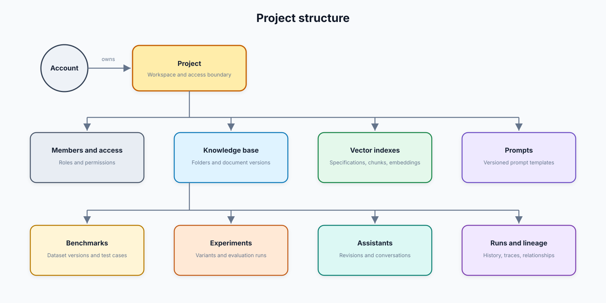
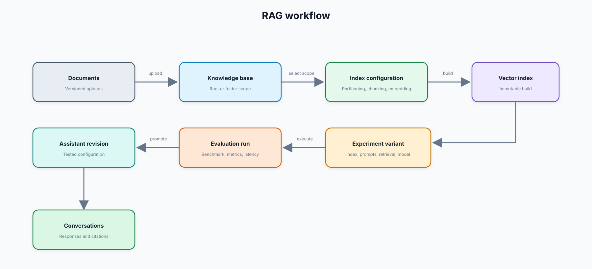
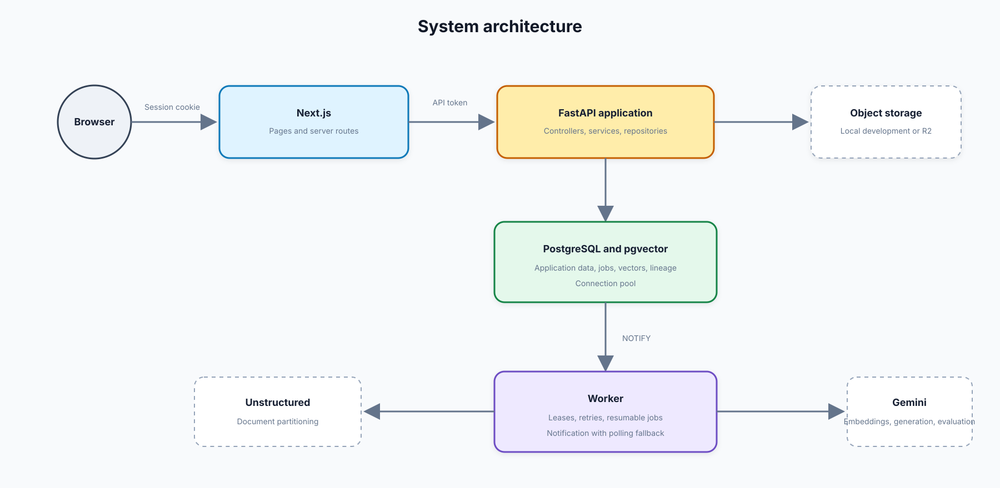
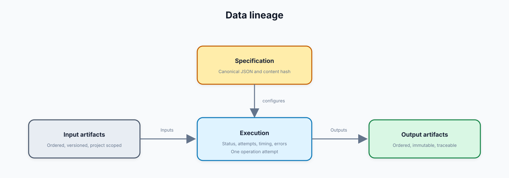

# RAG Experimentation and Evaluation System

This is a RAG experimentation and evaluation platform.

Its purpose is to help an engineering team turn documents into searchable knowledge, test different RAG configurations against the same questions, inspect the results, and promote a tested configuration into an assistant.

The platform is intentionally narrower than a general AI platform. Its main concerns are:

- knowledge management
- reproducible vector indexes
- versioned prompts and benchmark datasets
- controlled RAG experiments
- evaluation, tracing, and lineage
- assistants created from successful experiment runs
- project-level access control

## 2. The product model

An account receives a default project. The project is the main workspace and security boundary.



The important boundary is that knowledge, indexes, prompts, and benchmarks belong to the project rather than to an assistant. An assistant references a tested combination of these assets. This lets several experiments and assistants reuse the same project assets without copying or overwriting them.

## 3. Main workflow



Each step produces or references a durable record. This is what makes it possible to explain which documents, chunks, embedding model, prompts, and settings produced an experiment result or assistant answer.

## 4. Technical architecture

The repository contains two applications:

- `apps/frontend`: Next.js, React, and TypeScript;
- `apps/backend`: FastAPI, Python, PostgreSQL, and pgvector.

The backend image also provides the worker and migration commands.



### Frontend boundary

Next.js server routes act as a backend-for-frontend. Authentication tokens are stored in secure cookies and attached to FastAPI requests on the server. Browser components call same-origin Next.js routes rather than receiving backend access tokens directly.

Pages are grouped by project and mirror the product model: Knowledge Base, Indexes, Prompts, Benchmarks, Experiments, Assistants, Runs, and Settings. Loading states and module preloading are used to reduce the perceived delay between modules.

### Backend boundary

FastAPI is implemented as a modular monolith. Each product capability has its own controller, service, repository, models, and contracts where needed. The main modules are:

- `auth`: registration, login, token rotation, invitations, and rate limiting;
- `projects`: project lifecycle, members, and ACL permissions;
- `knowledge_bases` and `sources`: folders, document versions, previews, and audit activity;
- `ingestion` and `indexes`: partitioning, chunking, embeddings, and index builds;
- `prompts`: prompt presets and project-owned prompt versions;
- `benchmarks`: versioned evaluation datasets and cases;
- `experiments`: variants, execution, metrics, and resumable case results;
- `knowledge_bots`: promoted assistants and revisions;
- `chats`: assistant conversations, streaming generation, and citations;
- `core`: immutable specifications, artifacts, executions, and lineage;
- `jobs`: durable background-work state.

## 5. Knowledge and index pipeline

### Upload and versioning

A source is the logical document identity. A source version records the uploaded filename, size, content type, storage key, checksum, processing state, and timestamps. The file itself is stored outside PostgreSQL: local disk in development or R2-compatible object storage in production.

Folders organise knowledge and also define index scope. An index can select the knowledge-base root or selected folders. Refreshing an index queues only source versions that have not already been processed for that index specification.

### Partitioning, chunking, and embedding

Index creation registers an immutable pipeline specification containing:

- the selected knowledge base and folders;
- Unstructured partitioning settings;
- the chunking strategy;
- the embedding provider, model, dimensions, and distance metric.

The worker then performs the expensive stages outside the HTTP request:

1. Unstructured partitions a document into elements and preserves page/layout metadata.
2. Elements are assembled into chunks using the configured strategy.
3. Relationships record which elements contributed to each chunk.
4. The selected model embeds the chunks.
5. pgvector stores embeddings under the immutable index specification.

Separating the pipeline specification from the source document lets us compare embedding or chunking approaches without mutating an earlier index.

## 6. Experiments and evaluation

An experiment is a named comparison. A variant is one testable RAG configuration inside it.

A variant binds:

- an immutable index specification;
- versioned system and RAG-answer prompts;
- retrieval settings;
- Gemini generation settings;
- selected evaluation metrics.

A run can target one or more variants. Each selected variant runs against a fixed benchmark version, so comparisons use the same questions and expected answers. Results are stored per case, and variant runs remain independent: one failing variant does not invalidate another.

The runner records retrieval, generation, evaluation, and operational measurements. Current metrics include retrieval relevance measures, answer quality measures, provider usage, and per-stage latency. Metric results retain both the numeric value and the interpretation shown in the UI.

The runner uses:

- one asynchronous event loop;
- bounded variant, case, evaluator, and provider concurrency;
- provider request-rate controls;
- query-embedding caching within a run;
- bounded context assembly;
- reusable HTTP clients;
- leases and resumable case execution.

These controls improve throughput without allowing a large experiment to exhaust database connections or provider quotas.

## 7. Assistants and conversations

An assistant is created from a completed experiment run. Promotion copies the tested references and settings into an immutable assistant revision rather than pointing at mutable UI state.

The runtime loads that revision, retrieves chunks only from its selected index, assembles bounded context, applies the configured prompts, and streams the response from Gemini. Conversations belong to the assistant but are independent from one another.

Citations are derived from the chunks that remain relevant to the final answer. Citation markers are only retained when the configured response actually uses them; the system does not add empty citation markers automatically.

This creates a lineage path from an assistant response back through its revision, experiment run, variant, index, chunks, and original source documents.

## 8. Data and lineage model

PostgreSQL is both the transactional system of record and the vector store.

The domain tables hold operational entities such as users, projects, sources, prompts, benchmarks, experiments, assistants, conversations, and jobs. A separate metadata layer provides four reusable concepts:

- **Specification:** an immutable configuration, identified by canonical content and hash;
- **Artifact:** a versioned input or output such as a document, chunk dataset, vector index, or benchmark;
- **Execution:** one attempt to perform a defined operation;
- **Lineage edge:** the ordered input and output relationships around an execution.



Canonical JSON and content hashes give logically identical configurations deterministic identities. Composite foreign keys carry project identity into cross-resource relationships, preventing accidental links across projects. Database constraints protect immutable records and valid execution transitions even when application code is incorrect.

## 9. PostgreSQL index strategy

The database uses indexes according to the query being protected:

- B-tree indexes for identifiers, status, ownership, and timestamps;
- composite indexes for project-scoped lists and ordered histories;
- partial indexes for active resources, pending jobs, live leases, and unaccepted invitations;
- unique indexes for domain invariants and idempotency;
- GIN indexes for chunk keyword search;
- HNSW pgvector indexes for approximate nearest-neighbour retrieval.

Vector indexes are specification-aware so embeddings from different models, dimensions, or distance metrics are not mixed. Keeping relational filters and vector retrieval in PostgreSQL avoids maintaining a second database and a synchronisation pipeline at the current scale.

## 10. Background work and reliability

Jobs are durable PostgreSQL rows. Workers claim work using row locking with `SKIP LOCKED`, which allows multiple workers to compete safely without processing the same job.

A claimed job receives a lease. If the worker dies, another worker can reclaim it after the lease expires. Retry attempts and delayed availability provide bounded retry behaviour. Database uniqueness rules prevent duplicate active work for the same logical pipeline stage.

PostgreSQL `NOTIFY` wakes an idle worker after new work commits. The notification is deliberately not treated as the queue: it is only a low-latency signal. The worker also performs a timed fallback check, so a missed notification does not lose work.

This avoids continuous polling and avoids introducing Redis or a message broker before the workload requires one. The trade-off is one dedicated notification connection per worker and less sophisticated routing than a dedicated queue system.

## 11. Security and access

- Passwords use Argon2id hashing.
- Access tokens are short-lived.
- Refresh tokens are stored as hashes and rotated; reuse invalidates the token family.
- Production registration requires an invitation code.
- Registration and login limits are stored in PostgreSQL and work across API replicas.
- Raw client IP addresses are not retained for rate limiting.
- Every project request is authorised by the backend.
- Feature-level ACL permissions control knowledge, indexes, experiments, assistants, runs, and settings.
- The project owner always retains all privileges.
- Production configuration validation rejects unsafe authentication and CORS defaults.

Frontend visibility is a usability feature, not the security boundary. Permission enforcement must remain in backend services and repositories.

## 12. Deployment model

Local development uses Docker Compose for PostgreSQL, the API, worker, and persistent source storage. The frontend runs as a separate Next.js process.

Production builds container images through GitHub Actions, stores them in Amazon ECR, and deploys them to EC2. Migrations run as a separate deployment step before the API and worker restart. The deployed Git SHA is available as the application revision for traceability.

Production backend containers use a read-only filesystem, a temporary `/tmp`, dropped Linux capabilities, and `no-new-privileges`. Uploaded objects use R2-compatible storage rather than container disk.

The API and worker commands are both still required:

- `ragapp-api` serves HTTP traffic;
- `ragapp-worker` processes durable ingestion, indexing, and experiment work;
- `ragapp-migrate` applies ordered SQL migrations.

## 13. Important engineering decisions

### Modular monolith over microservices

One backend is easier to develop, test, migrate, and deploy. Module boundaries preserve the option to extract services later. We will only split a component when independent scale, ownership, or reliability requirements justify it.

### PostgreSQL as database, queue state, and vector store

This reduces infrastructure and keeps transactions, permissions, lineage, jobs, and vector metadata consistent. The known trade-off is that very large vector workloads or complex queue routing may eventually justify specialised services.

### Immutable configurations and outputs

Experiments need honest comparisons. Updating a configuration in place would make historical results ambiguous, so specifications, prompt versions, benchmark versions, index outputs, and promoted assistant revisions are versioned or immutable.

### Asynchronous work only where it helps

Network-bound experiment work uses async concurrency. Blocking document processing is moved to a thread when coordinated by the async worker. Simple transactional application operations remain straightforward rather than being converted mechanically.

### Durable jobs plus notification-driven wake-up

PostgreSQL rows guarantee recovery; notifications reduce idle polling and startup latency. Correctness does not depend on receiving a notification.

### Server-side authentication proxy

Next.js owns browser sessions and backend tokens. This reduces client-side token exposure and centralises refresh/error behaviour, at the cost of an additional request hop.

### Production guardrails without platform sprawl

Connection pooling, bounded concurrency, leases, idempotency, rate limiting, lineage, and hardened containers address concrete failure modes. Dedicated brokers, orchestration platforms, and separate vector databases are deferred until measured demand warrants them.

## 14. To Get started with the codebase

Use the following reading order:

1. `README.md` for the product-level summary and commands.
2. `apps/backend/src/api/main.py` for API composition.
3. `apps/frontend/src/app/projects/[projectId]` for the project UI structure.
4. A module controller, service, and repository together to understand one feature vertically.
5. `apps/backend/src/modules/core` for specifications, artifacts, executions, and lineage.
6. `apps/backend/src/worker.py` and `modules/ingestion/services/ingestion_worker.py` for job execution.
7. `modules/experiments/services/experiment_runner.py` for async experiment execution.
8. `apps/backend/src/migrations` for the authoritative database model and constraints.

## 15. Local development

### Backend

Switch to backend directory

```bash
cd apps/backend
```

Start PostgreSQL, the API, and the worker:

```bash
docker compose up --build -d
```

Apply migrations:

```bash
docker compose run --rm api ragapp-migrate
```

Run backend tests:

```bash
PYTHONPATH=src .venv/bin/python -m unittest discover -s tests -p 'test_*.py'
```

Start the frontend:
Switch to frontend directory

```bash
cd apps/frontend
```

Install dependencies and start the frontend server

```bash
pnpm install
pnpm dev
```

Useful checks:

```bash
pnpm typecheck
pnpm lint
pnpm build
```

Local endpoints:

- frontend: `http://localhost:3000`
- backend health: `http://localhost:8000/health`
- OpenAPI documentation: `http://localhost:8000/docs`
- PostgreSQL from the host: `localhost:5433`
- pgAdmin: `http://localhost:5050`
